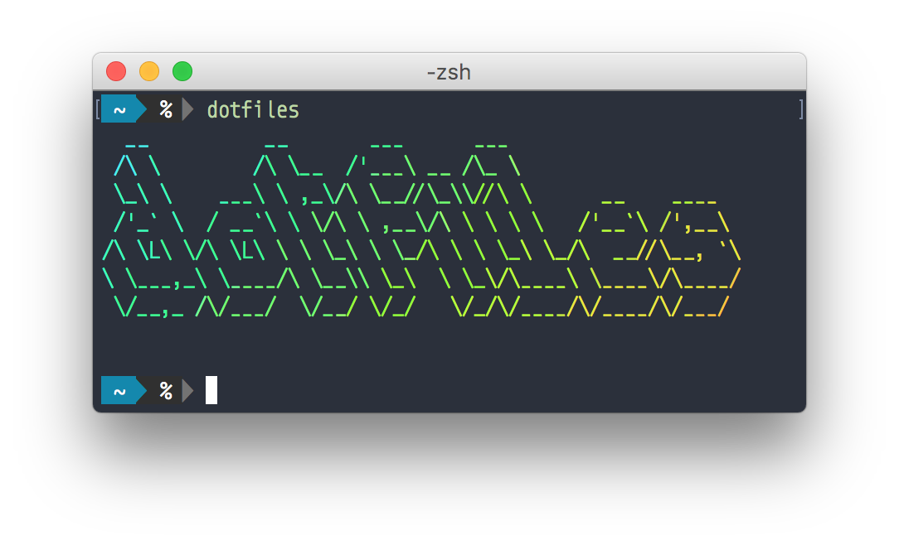

# Anvilabs dotfiles




This repository holds our opinionated [configuration files](https://en.wikipedia.org/wiki/Configuration_file).

## Installation

Review [the script](https://raw.githubusercontent.com/anvilabs/dotfiles/master/install.sh) and run the following command:
```bash
curl -fsSL https://raw.githubusercontent.com/anvilabs/dotfiles/master/install.sh | sh
```

> You can also [fork this repo](https://github.com/anvilabs/dotfiles#fork-destination-box) and [keep it updated](http://robots.thoughtbot.com/keeping-a-github-fork-updated) in case you want to make customizations.

---

You can also try these dotfiles without polluting your development environment.

First install [Vagrant](https://www.vagrantup.com/docs/installation/) and [VirtualBox](https://www.virtualbox.org/wiki/Downloads). Then set up a Sierra machine by running:

```bash
vagrant init jhcook/macos-sierra
vagrant up --provider virtualbox
```

## What the installation script sets up:

Unix:
- [zsh](http://www.zsh.org/) as your default shell
- [zplug](https://github.com/zplug/zplug) for managing zsh plugins
- [vim-plug](https://github.com/junegunn/vim-plug) for managing vim plugins
- [Powerline](https://github.com/banga/powerline-shell) for your shell prompt
- [A cron job](https://raw.githubusercontent.com/anvilabs/dotfiles/master/update.sh) to regularly update your global packages

Programming language environments (if you want them):

- [pyenv](https://github.com/yyuu/pyenv) for Python
- [rbenv](https://github.com/rbenv/rbenv) for Ruby
- [n](https://github.com/tj/n) for Node.js

This repo also includes the Spacegray color theme both for [Terminal.app](https://github.com/wtanna/Spacegray-OSX-Terminal-Theme) and for [iTerm2](https://github.com/christianbundy/spacegrey-iterm). It will set up the theme automatically with the [Monoid font](https://larsenwork.com/monoid/) for Terminal.app.

## Make your own customizations

Put your customizations in `~/.dotfiles/symlinks/` appended with `.local`. Customizable symlinks include:

- symlinks/gitconfig.local
- symlinks/tmux.conf.local
- symlinks/vimrc.local
- symlinks/vimrc.bundles.local
- symlinks/zshenv.local
- symlinks/zshrc.local
- symlinks/zshrc.plugins.local

For example, your `gitconfig.local` might look like the following:

```ini
[user]
  name = Ayan Yenbekbay
  email = ayan.yenb@gmail.com
  github = yenbekbay
  signingkey = ayan.yenb@gmail.com
[commit]
  gpgsign = true
[gpg]
  program = /usr/local/bin/gpg2
```

## Credits

Inspired by:

- [@b4b4r07's dotfiles](https://github.com/b4b4r07/dotfiles)
- [@mathiasbynens's dotfiles](https://github.com/mathiasbynens/dotfiles)
- [@thoughtbot's dotfiles](https://github.com/thoughtbot/dotfiles)

## License

[MIT License](./LICENSE) © Anvilabs LLC
